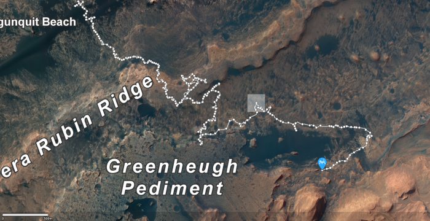

# From Mars to Mull: Interplanetary comparison of soil XRPD data {#mars}

This chapter will use [data](https://pds.nasa.gov/ds-view/pds/viewDataset.jsp?dsid=MSL-M-CHEMIN-4-RDR-V1.0) from the Mars Science Laboratory (MSL) onboard NASA's Curiosity Rover. The MSL XRPD data were obtained from the [Geosciences Data Volume Online](https://pds-geosciences.wustl.edu/msl/msl-m-chemin-4-rdr-v1/) as ASCII '.csv' files on the 17^th^ July 2021 and loaded into R [@Vaniman2012] using `read.csv()`.

The mineral compositions of the samples in the MSL dataset are described and discussed in numerous publications [@Bish2013; @Grotzinger2014; @Vaniman2014; @Bristow2015; @Bristow2018]. The many clay minerals identified and quantified from the XRPD provides compelling evidence that the surface material has been altered by water.

Qualitative and quantitative analysis of clay minerals is a notoriously challenging undertaking, often requiring separation of the clay fraction onto oriented slides combined with several ethylene-glycol and heat treatments. The MSL cannot separate the clay fraction from Martian samples and is limited to bulk sample analysis, where clay minerals are analysed in a randomly oriented powder along with all other crystalline and amorphous components within the sample. This has acted to create uncertainty in the analysis of clay minerals from MSL XRPD data [@Bish2013; @Grotzinger2014; @Vaniman2014; @Bristow2018]. Identification of Earth based analogues for Martian soil mineralogy therefore represent an opportunity to facilitate more accurate interpretation of the clay mineralogy encoded within MSL XRPD data. Further, understanding the development of mineralogically analogous soils on Earth has potential to aid the development of hypotheses for the environmental properties of aqueous systems on ancient Mars [@Marlow2008].

Here, soil XRPD data from the National Soil Inventory of Scotland [@Butler2018] will be compared to the XRPD data from Mars in the aim of identifying potential soil analogues for Martian mineralogy.

## Data
Data for this example is stored within a **mars2mull** R package hosted on GitHub. The package can be installed using the **devtools** package

```{r, eval = FALSE}
#Install devtools if it's not already on your machine
install.packages("devtools")

#Use devtools to install the mars2mull package from GitHub
devtools::install_github("benmbutler/mars2mull")
```

### Mars Science Laboratory XRPD Data
Martian XRPD data within the package have been extracted from NASA's [Geosciences Data Volume Online](https://pds-geosciences.wustl.edu/msl/msl-m-chemin-4-rdr-v1/) [@Vaniman2012] and renamed according to the various sites that were sampled. The diffractograms of 31 Martian samples are contained within the `mars_xrpd` data in [`multiXY` format](#loading-multiple). All diffractograms were collected using Co-K$\alpha$ radiation, with further details of the data collection and instrumental parameters provided elsewhere [@Bish2013; @Grotzinger2014; @Vaniman2014; @Bristow2015; @Bristow2018]. Further to the XRPD data, additional information about each of the samples is provided in the `mars_id` data:

```{r, cache = TRUE}
#load the mars2mull package
library(mars2mull)

#load powdR so that the XRPD data can be plotted
library(powdR)

#load the Martian XRPD data
data(mars_xrpd)

#plot the 31 Martian diffractograms
plot(mars_xrpd, wavelength = "Co",
     normalise = TRUE, interactive = TRUE)

#load the extra information about the samples interactively
data(mars_id)

#View the first four columns of the mars_id data
mars_id[1:4]
```

The locations of the 31 samples can be explored using the `SOL_START` and `SOL_END` columns in the `mars_id` data in combination with [NASA's online map for Curiosity's location](https://mars.nasa.gov/maps/location/?mission=Curiosity).

<center>
<a href="https://mars.nasa.gov/maps/location/?mission=Curiosity"></p></a>
</center>

### Scottish Soil XRPD data
The Scottish soil diffractograms relate to 773 samples collected by horizon from 207 sites across Scotland. Samples were collected primarily as part of the second National Soil Inventory of Scotland [NSIS, @Butler2018] and are supplemented by additional samples of rare Scottish soils.

```{r, fig.cap = "Interactive map of the sampling locations for the Scottish soils. Blue symbols represent samples associated with the NSIS dataset. Yellow symbols represent samples associated with the Rare Soils dataset.", out.width='80%', fig.align='center', message=FALSE, warning=FALSE, cache = TRUE}
#Load the scotland_locations data
data(scotland_locations)

#Show the first 6 rows of the data
head(scotland_locations)

#load the leaflet package
library(leaflet)

#Plot the data of "NSIS" and "Rare" samples in different colours
leaflet() %>% 
  addTiles() %>%
  addCircleMarkers(data = scotland_locations[scotland_locations$DATASET == "NSIS",],
                   ~PROFILE_LONGITUDE, ~PROFILE_LATITUDE,
                   color = "blue",
                   opacity = 1) %>% 
  addCircleMarkers(data = scotland_locations[scotland_locations$DATASET == "Rare",],
                   ~PROFILE_LONGITUDE, ~PROFILE_LATITUDE,
                   color = "yellow",
                   opacity = 1)

```

The XRPD data were collected using Cu-K$\alpha$ radiation [for details see @Butler2018] and are included within the **mars2mull** package in the `scotland_xrpd` data, which a data frame rather than a `multiXY` object in order to save on file size when transferring to/from GitHub.

```{r, cache = TRUE}
#Load the Scottish XRPD data
data(scotland_xrpd)

#Check the class of the data
class(scotland_xrpd)
```

## Data manipulation
The aim of this analysis is to compare all Martian diffractograms from the MSL to all Scottish soil diffractograms and hence identify those with the greatest similarity. In this case, similarity will be assessed using the Pearson correlation coefficient. Such comparison requires the data to be on identical 2$theta$ axes, which can be achieved by applying the following manipulations need to the data:

1. Transform the 2$\theta$ scale of the `scotland_xrpd` data to its Co-K$\alpha$ equivalent
2. Calculate the overlapping 2$\theta$ range of the two datasets
3. Interpolate the data onto a harmonised 2$\theta$ scale
4. Align each sample during pair-wise comparison
