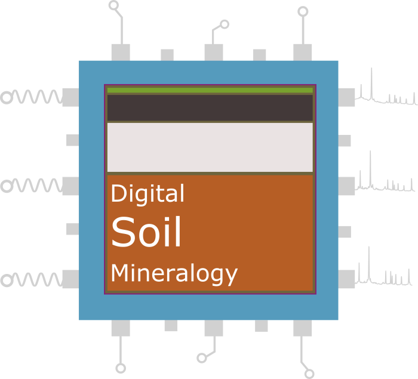

--- 
title: "Digital Soil Mineralogy with R"
author: "Benjamin Butler and Steve Hillier"
date: "`r Sys.Date()`"
site: bookdown::bookdown_site
documentclass: book
bibliography: [book.bib, packages.bib]
biblio-style: apalike
link-citations: yes
colorlinks: yes
lot: yes
lof: yes
fontsize: 12pt
description: "An online course detailing various methods for data-driven analysis of X-ray powder diffraction using R"
cover-image: figures/dsm_graphic.png
---

# Preface {-}

```{r, echo=FALSE, out.width = '50%', fig.align="center", cache = TRUE}
if (knitr:::is_html_output())
{
  
}
```

Digital Soil Mineralogy relates to the data-driven analysis of soil X-ray powder diffraction (XRPD) data. Such data are considered to be precise digital signatures of a given soil's mineralogy, within which is all of the information required to identify and quantify the various mineral components within these complex mixtures.

In recent years various methods for Digital Soil Mineralogy have been developed and published in peer-reviewed literature. These methods include the use of supervised and unsupervised machine learning to predict and interpret soil properties from XRPD data, the application of novel multivariate statistical methods, and automated approaches for mineral quantification. Each chapter in this documentation will detail one such method, providing code and data for reproducible examples that can be adapted by readers for their own projects/research.

Whilst all data and methods presented herein relate to soil samples, the methods can be considered transferable to all aspects of environmental mineralogy and beyond!

## Prerequisites {-}
To run the examples provided throughout this document, it is recommended that you have [R](https://www.r-project.org/) and [RStudio](https://www.rstudio.com/products/rstudio/) installed on your machine. Once that's set up, then additional extensions (packages) required along the way can be installed and loaded. R and it's extensions are designed to be multi-platform so all material presented here should work on Windows, Mac, or Linux. The only package needed from the very start of the document is [`powdR`](https://cran.r-project.org/web/packages/powdR/index.html), and subsequent packages will be introduced in later chapters. To install `powdR`, use:

```{r, eval = FALSE}
install.packages("powdR")
```

## Code Conventions {-}
This document contains many chunks of R code that provide reproducible examples that can be copied and pasted to run on your own computer, for instance:

```{r, cache = TRUE}
#Summarise a vector of integers 1 to 10
summary(1:10)
```

Text outputs associated with R code are denoted by two hashes (`##`) by default, as you can see from the example above. This is for your convenience when you want to copy and run the code (the text output will be ignored since it is commented out). Inline code and filenames are formatted in a typewriter font (e.g., `summary(1:10)`). Function names are followed by parentheses (e.g., `mean(1:10)`).

## What to expect {-}
This document is divided into chapters that each detail specific aspects of Digital Soil Mineralogy. To start with, the basics of handling XRPD data in R are introduced, which progresses to more advanced manipulation of such data that cannot be realised with proprietary XRPD software. Subsequently, specific examples of methods for Digital Soil Mineralogy are provided that include high throughput quantitative analysis, data mining, and cluster analysis. As such, the documentation is separated into the following chapters:

* Chapter \@ref(intro): Loading and handling XRPD data in R
* Chapter \@ref(quant): Quantitative analysis of XRPD data using full pattern summation
* Chapter \@ref(machine-learning): The use of machine learning to predict and interpret soil properties from XRPD data
* Chapter \@ref(cluster-analysis): The application of cluster analysis to identify discrete groups of soils based on mineralogy
* Chapter 5: Identifying soils analogues for Martian mineralogy based on XRPD data

Each chapter contains reproducible R code along with written explanations and video tutorials. With exception to Chapter \@ref(intro), all chapters are standalone so there is no need to read everything!

## About the authors {-}
* [**Benjamin Butler**](https://www.hutton.ac.uk/staff/benjamin-butler) is a Digital Mineralogist at the James Hutton Institute, Aberdeen, UK. His interests centre around the use of XRPD to characterise the mineral composition of environmental mixtures such as soils, construction and demolition waste, and sea ice. As an active R user he has authored the `powdR` package that provides a range of methods for quantitative analysis of XRPD data using full pattern summation. Aside from dealing with data, he is involved in regular soil surveys on forestry land across Scotland, allowing him to observe soils from the digging to the databases.

* [**Steve Hillier**](https://www.hutton.ac.uk/staff/steve-hillier) is a Soil Mineralogist at the James Hutton Institute, Aberdeen, UK...

## Acknowledgments {-}
The research that comprises the bulk of this material, and the time required to create this material was kindly funded by the Macaulay Development Trust. The support of the Scottish Government. The support of the Scottish Government’s Rural and Environment Science and Analytical Services Division (RESAS) is also gratefully acknowledged.

```{r, echo=FALSE, out.width = '100%', fig.align="center", cache = TRUE}
if (knitr:::is_html_output())
{
  knitr::include_graphics("figures/acknowledgements_small.png")
}
```

```{r include=FALSE, cache = TRUE}
# automatically create a bib database for R packages
knitr::write_bib(c(
  .packages(), 'bookdown', 'knitr', 'rmarkdown', 'leaflet', 'Cubist', 'caret'
), 'packages.bib')
```
